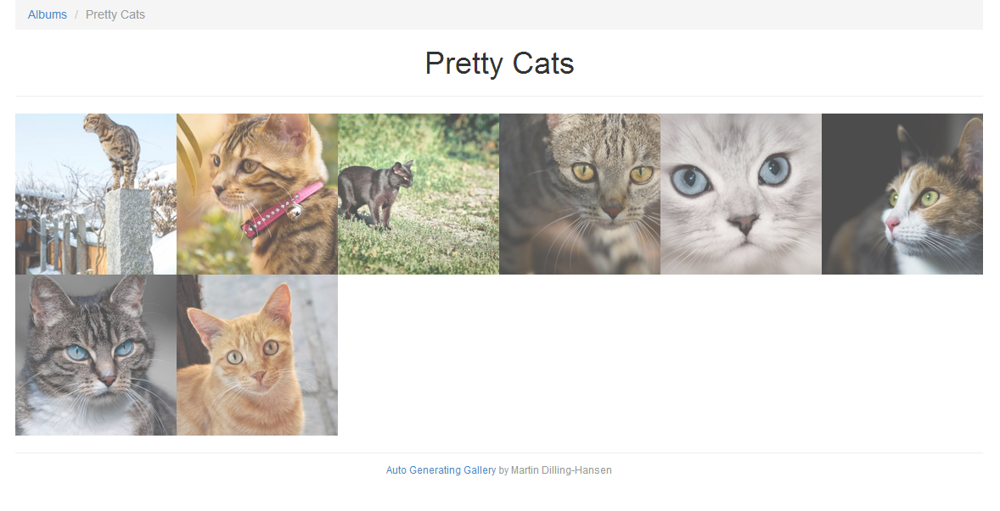
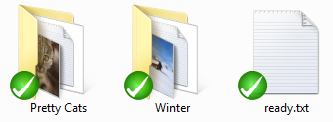
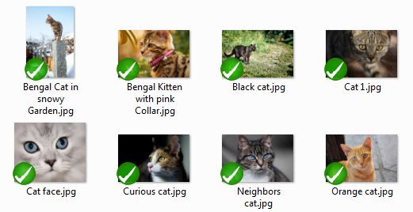

Auto Generating Gallery
=======================

[See the demo](http://gallerydemo.martindilling.com)

**Pretty, simple and easy gallery.**

1. Upload albumfolder via ftp
2. Visit domain.com/import
3. Done ;)

***Sorry for the bad description and guide, but you are all more than welcome to help with issues and pull requests, both for the readme and the code ;)***

## Installation

Like with Laravel 4 you need to install all the nessesary packages with composer:

    composer install

Configure the database settings in *app/config/database.php*
And migrate the database with:

    artisan migrate

Change configuration of the gallery in *app/config/filegallery.php*

That should be it ;)

## Albums

Albums will be created from the folders in the 'uploads' folder.
The foldername will be used as the albumname, and the folders will be renamed to
a more webfriendly name (strip special characers and replace spaces with dashes).

## Images

Images will be created from the imagefiles in the album folders.
Don't worry about the names they will be renamed to more webfriendly names
(strip special characers and replace spaces with dashes).

## Image descriptions

To create a description for an image, create a *.txt file with the same name as
the imagefile, and write the description in that file.

## Album cover

To set an image from the album as the cover picture, create an empty *.txt file,
and name it '%imagefilename%_cover.txt'

To create an album you upload a folder (the album) with images to the uploads
folder configured in *app/config/filegallery.php* (default: 'uploads')

    - public
        - uploads
            - Album1           // Name of the album, folder will be made websafe on import
                - Image1.jpg   // Image title, filename will be made websafe on import
                - Image2.jpg
                - Image2.txt   // Text file with description for Image2.jpg
                - Image3.jpg
            - Album2
                - Image4.jpg
                - Image5.jpg
            - ready.txt        // Will only try to upload if this file exists

Names of the folders created in the 'public/uploads' folder will be the album names.
To create a description to an image create a *.txt file with the same name as the
imagefile, and write the description in that file.
To create the album, create a 'ready.txt' file in the 'uploads' folder, and
visit the page http://domain.com/import, and it will create the nessesary files
and create the albums in the database :)
